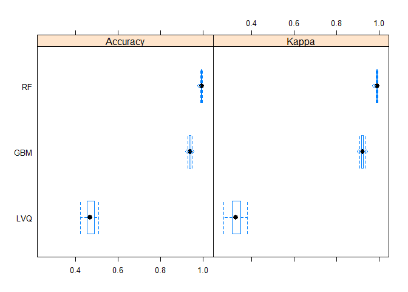
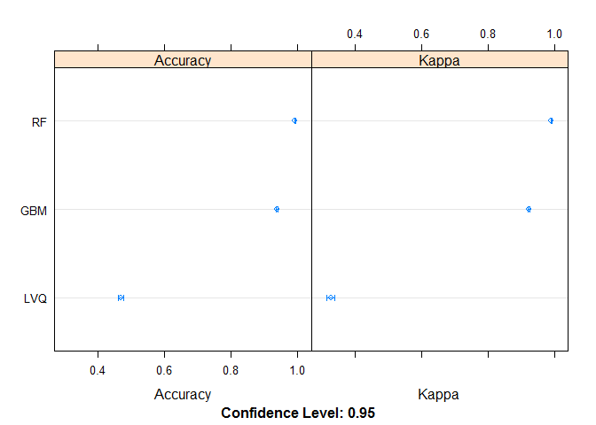
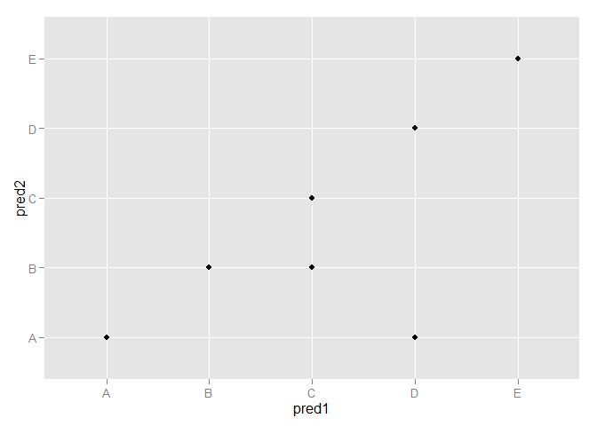

# Coursera: Practical Machine Learning Prediction Assignment
Michael Payne  
November 12, 2015  

###Background

Using devices such as Jawbone Up, Nike FuelBand, and Fitbit it is now possible to collect a large amount of data about personal activity relatively inexpensively. These type of devices are part of the quantified self movement - a group of enthusiasts who take measurements about themselves regularly to improve their health, to find patterns in their behavior, or because they are tech geeks. One thing that people regularly do is quantify how much of a particular activity they do, but they rarely quantify how well they do it. In this project, your goal will be to use data from accelerometers on the belt, forearm, arm, and dumbell of 6 participants. They were asked to perform barbell lifts correctly and incorrectly in 5 different ways. More information is available from the website here: http://groupware.les.inf.puc-rio.br/har (see the section on the Weight Lifting Exercise Dataset). 

###Data 

The training data for this project are available here: 

https://d396qusza40orc.cloudfront.net/predmachlearn/pml-training.csv

The test data are available here: 

https://d396qusza40orc.cloudfront.net/predmachlearn/pml-testing.csv

The data for this project come from this source: http://groupware.les.inf.puc-rio.br/har. If you use the document you create for this class for any purpose please cite them as they have been very generous in allowing their data to be used for this kind of assignment. 

###What you should submit

The goal of your project is to predict the manner in which they did the exercise. This is the "classe" variable in the training set. You may use any of the other variables to predict with. You should create a report describing how you built your model, how you used cross validation, what you think the expected out of sample error is, and why you made the choices you did. You will also use your prediction model to predict 20 different test cases. 

1. Your submission should consist of a link to a Github repo with your R markdown and compiled HTML file describing your analysis. Please constrain the text of the writeup to < 2000 words and the number of figures to be less than 5. It will make it easier for the graders if you submit a repo with a gh-pages branch so the HTML page can be viewed online (and you always want to make it easy on graders :-).
2. You should also apply your machine learning algorithm to the 20 test cases available in the test data above. Please submit your predictions in appropriate format to the programming assignment for automated grading. See the programming assignment for additional details. 

###Reproducibility 

Due to security concerns with the exchange of R code, your code will not be run during the evaluation by your classmates. Please be sure that if they download the repo, they will be able to view the compiled HTML version of your analysis. 

##Datasets Preparation

#### Get raw data
Load the data and Process/transform the data into a format suitable for analysis.

#### Set WD

```r
setwd("C://temp/")
```

#### Load required libraries

```r
library(plyr)
library(dplyr)
library(ggplot2)
library(lattice)
library(caret)
library(class)
library(pROC)
library(tidyr)
```

#### Load Data sets from Working Directory


```r
pmltest <- data.frame(read.csv("pml-testing.csv"),stringsAsFactors = FALSE)
pmltrain <- data.frame(read.csv("pml-training.csv"),stringsAsFactors = FALSE)
```


#### Investigate data structure to find percentage of predictors that have missing data


```r
tr <- pmltrain %>%
    summarise_each(funs(mean(is.na(.)))) %>%
    gather(Pred)%>%
    filter(value > 0)
tr
```

```
##                        Pred     value
## 1             max_roll_belt 0.9793089
## 2            max_picth_belt 0.9793089
## 3             min_roll_belt 0.9793089
## 4            min_pitch_belt 0.9793089
## 5       amplitude_roll_belt 0.9793089
## 6      amplitude_pitch_belt 0.9793089
## 7      var_total_accel_belt 0.9793089
## 8             avg_roll_belt 0.9793089
## 9          stddev_roll_belt 0.9793089
## 10            var_roll_belt 0.9793089
## 11           avg_pitch_belt 0.9793089
## 12        stddev_pitch_belt 0.9793089
## 13           var_pitch_belt 0.9793089
## 14             avg_yaw_belt 0.9793089
## 15          stddev_yaw_belt 0.9793089
## 16             var_yaw_belt 0.9793089
## 17            var_accel_arm 0.9793089
## 18             avg_roll_arm 0.9793089
## 19          stddev_roll_arm 0.9793089
## 20             var_roll_arm 0.9793089
## 21            avg_pitch_arm 0.9793089
## 22         stddev_pitch_arm 0.9793089
## 23            var_pitch_arm 0.9793089
## 24              avg_yaw_arm 0.9793089
## 25           stddev_yaw_arm 0.9793089
## 26              var_yaw_arm 0.9793089
## 27             max_roll_arm 0.9793089
## 28            max_picth_arm 0.9793089
## 29              max_yaw_arm 0.9793089
## 30             min_roll_arm 0.9793089
## 31            min_pitch_arm 0.9793089
## 32              min_yaw_arm 0.9793089
## 33       amplitude_roll_arm 0.9793089
## 34      amplitude_pitch_arm 0.9793089
## 35        amplitude_yaw_arm 0.9793089
## 36        max_roll_dumbbell 0.9793089
## 37       max_picth_dumbbell 0.9793089
## 38        min_roll_dumbbell 0.9793089
## 39       min_pitch_dumbbell 0.9793089
## 40  amplitude_roll_dumbbell 0.9793089
## 41 amplitude_pitch_dumbbell 0.9793089
## 42       var_accel_dumbbell 0.9793089
## 43        avg_roll_dumbbell 0.9793089
## 44     stddev_roll_dumbbell 0.9793089
## 45        var_roll_dumbbell 0.9793089
## 46       avg_pitch_dumbbell 0.9793089
## 47    stddev_pitch_dumbbell 0.9793089
## 48       var_pitch_dumbbell 0.9793089
## 49         avg_yaw_dumbbell 0.9793089
## 50      stddev_yaw_dumbbell 0.9793089
## 51         var_yaw_dumbbell 0.9793089
## 52         max_roll_forearm 0.9793089
## 53        max_picth_forearm 0.9793089
## 54         min_roll_forearm 0.9793089
## 55        min_pitch_forearm 0.9793089
## 56   amplitude_roll_forearm 0.9793089
## 57  amplitude_pitch_forearm 0.9793089
## 58        var_accel_forearm 0.9793089
## 59         avg_roll_forearm 0.9793089
## 60      stddev_roll_forearm 0.9793089
## 61         var_roll_forearm 0.9793089
## 62        avg_pitch_forearm 0.9793089
## 63     stddev_pitch_forearm 0.9793089
## 64        var_pitch_forearm 0.9793089
## 65          avg_yaw_forearm 0.9793089
## 66       stddev_yaw_forearm 0.9793089
## 67          var_yaw_forearm 0.9793089
```

####Select columns with no missing data


```r
tr2 <- pmltrain %>%
    select(X:skewness_yaw_belt, max_yaw_dumbbell,amplitude_pitch_dumbbell,amplitude_yaw_dumbbell,gyros_dumbbell_x:skewness_yaw_forearm,max_yaw_dumbbell,min_yaw_dumbbell,amplitude_yaw_dumbbell,total_accel_dumbbell,gyros_dumbbell_x:skewness_yaw_forearm,max_yaw_forearm,min_yaw_forearm,amplitude_yaw_forearm,total_accel_forearm,gyros_forearm_x:classe,-amplitude_pitch_dumbbell)
```

####Remove indicator variables, timestamp, other mono variables and other coloumns with mostly null variables


```r
tr3 <- tr2 %>%
    select(-X,-user_name,-raw_timestamp_part_1,-raw_timestamp_part_2,-cvtd_timestamp,-new_window,-num_window)%>%
    select(-starts_with("kurtosis"))%>%
    select(-starts_with("skewness"))%>%
    select(-contains("yaw"))
```

##Build Model
####Use Bootstrap option for cross validation (ie Random Resampling)involves taking random samples from the dataset (with re-selection) against which to evaluate the model.

###Prepare training data set


```r
control <- trainControl(method="repeatedcv", number=10, repeats=3)
```

###Select models to train against
#### Train the LVQ model

```r
set.seed(7)
modelLvq <- train(classe~., data=tr3, method="lvq", trControl=control)
```


```r
set.seed(7)
modelGbm <- train(classe~., data=tr3, method="gbm", trControl=control, verbose=FALSE)
```


#### Train the Random Forrest model

```r
set.seed(7)
modelRf <- train(classe ~.,method="rf",
              data=tr3, 
              trControl =control)
```
### Load Models

```r
load("modelRf.Rda")
load("modelGbm.Rda")
load("modelLvq.Rda")
```

#### Compare models


```r
results <- resamples(list(LVQ=modelLvq, GBM=modelGbm, RF=modelRf))
```

#### Summarise the distributions

```r
summary(results)
```

```
## 
## Call:
## summary.resamples(object = results)
## 
## Models: LVQ, GBM, RF 
## Number of resamples: 30 
## 
## Accuracy 
##       Min. 1st Qu. Median   Mean 3rd Qu.   Max. NA's
## LVQ 0.4228  0.4557 0.4689 0.4696  0.4880 0.5097    0
## GBM 0.9241  0.9342 0.9388 0.9379  0.9409 0.9516    0
## RF  0.9817  0.9908 0.9921 0.9917  0.9933 0.9949    0
## 
## Kappa 
##       Min. 1st Qu. Median   Mean 3rd Qu.   Max. NA's
## LVQ 0.2706  0.3089 0.3270 0.3279  0.3499 0.3821    0
## GBM 0.9040  0.9168 0.9226 0.9215  0.9252 0.9388    0
## RF  0.9768  0.9884 0.9900 0.9895  0.9915 0.9936    0
```

### boxplots of results

```r
bwplot(results)
```

 

### dot plots of results

```r
dotplot(results)
```

 

###Process test set like training set to get the same variables


```r
pmltest_1 <- pmltest %>%
    select(X:skewness_yaw_belt, max_yaw_dumbbell,amplitude_pitch_dumbbell,amplitude_yaw_dumbbell,gyros_dumbbell_x:skewness_yaw_forearm,max_yaw_dumbbell,min_yaw_dumbbell,amplitude_yaw_dumbbell,total_accel_dumbbell,gyros_dumbbell_x:skewness_yaw_forearm,max_yaw_forearm,min_yaw_forearm,amplitude_yaw_forearm,total_accel_forearm,gyros_forearm_x:magnet_forearm_z,-amplitude_pitch_dumbbell) %>%
    select(-X,-user_name,-raw_timestamp_part_1,-raw_timestamp_part_2,-cvtd_timestamp,-new_window,-num_window)%>%
    select(-starts_with("kurtosis"))%>%
    select(-starts_with("skewness"))%>%
    select(-contains("yaw"))    
```

###Plot the best 2 models against each other


```r
pred1 <- predict(modelGbm,pmltest_1); pred2 <- predict(modelRf,pmltest_1)
```

```
## Loading required package: gbm
## Loading required package: survival
## 
## Attaching package: 'survival'
## 
## The following object is masked from 'package:caret':
## 
##     cluster
## 
## Loading required package: splines
## Loading required package: parallel
## Loaded gbm 2.1.1
## Loading required package: randomForest
## randomForest 4.6-12
## Type rfNews() to see new features/changes/bug fixes.
## 
## Attaching package: 'randomForest'
## 
## The following object is masked from 'package:dplyr':
## 
##     combine
```

```r
qplot(pred1,pred2,data=pmltest_1)
```

 

### Select the Random Forrest model on the test set, as this is shown to have the highest mean accuracy at 99.17%


```r
pred21 <- data.frame(predict(modelRf,pmltest))
pred21
```

```
##    predict.modelRf..pmltest.
## 1                          B
## 2                          A
## 3                          B
## 4                          A
## 5                          A
## 6                          E
## 7                          D
## 8                          B
## 9                          A
## 10                         A
## 11                         B
## 12                         C
## 13                         B
## 14                         A
## 15                         E
## 16                         E
## 17                         A
## 18                         B
## 19                         B
## 20                         B
```


